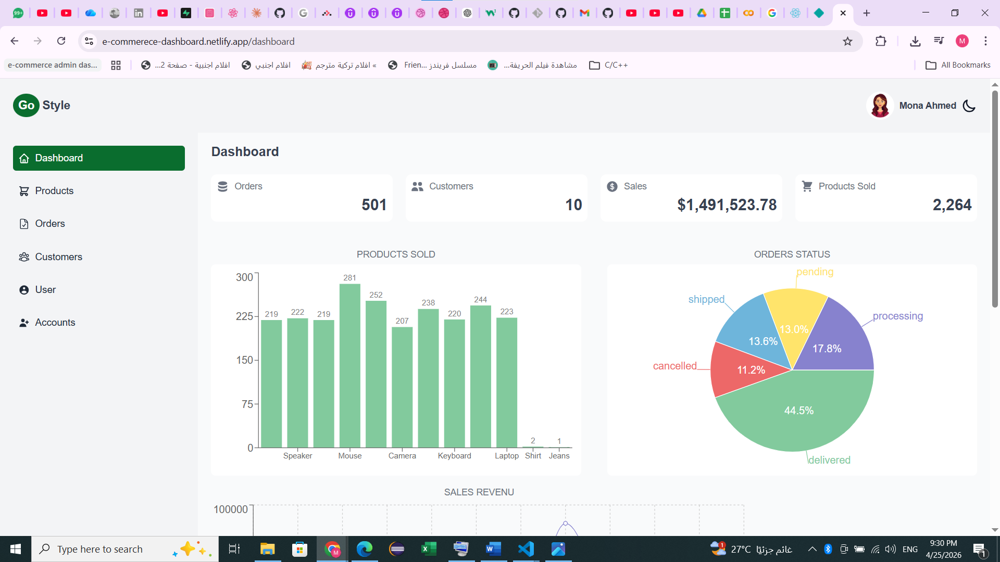
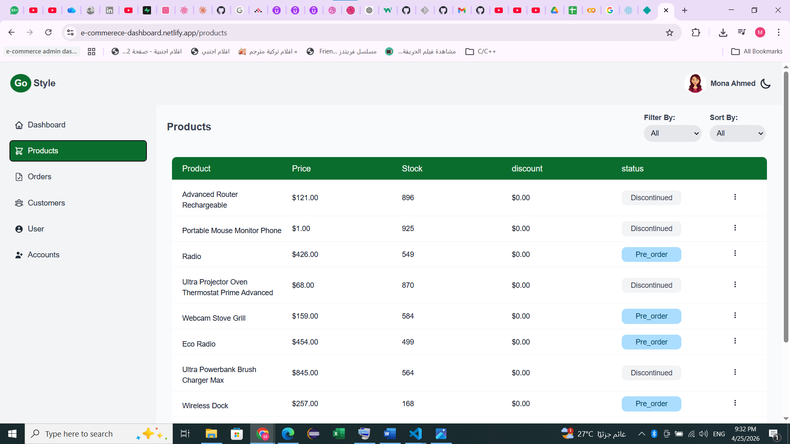
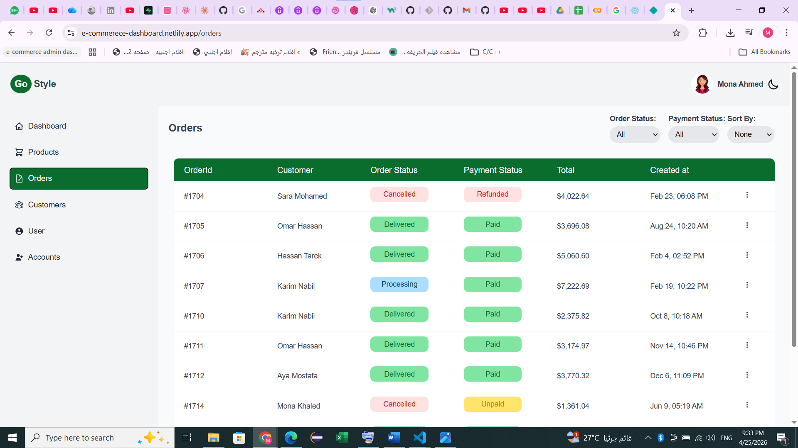
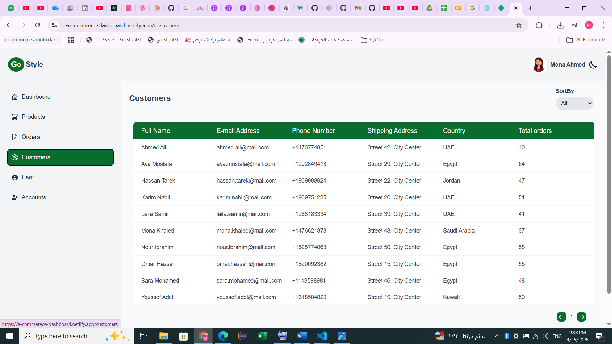
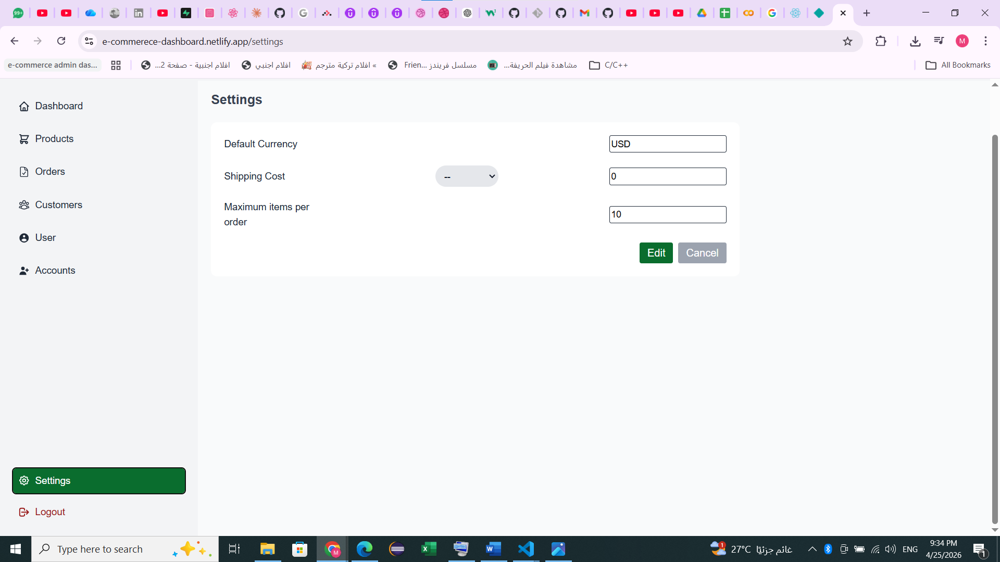

# 📊 E-Commerce Admin Dashboard

A modern **Admin Dashboard** for managing an e-commerce system.  
The dashboard allows administrators to manage **products, orders, and store settings**, monitor **revenue**, and track **order statuses** through a clean and responsive interface.

This project simulates real-world e-commerce workflows using realistic order and payment logic.

---

# 📸 Screenshots / Demo

## Project Demo

[Project Demo ](https://drive.google.com/file/d/1spDGpaBCUXcEPmQl8G19pAlfmqbWlTCD/view?usp=sharing)

## Dashboard Overview



## Products Page



## Orders Page



## Customers Page



## Settings Page



---

# 🛠️ Tech Stack

## Frontend

- React.js
- React Router
- React Query (@tanstack/react-query)
- React Hook form
- React icons
- React toast
- Styled Components

## Backend & Database

- Supabase

## Tools

- Git & GitHub
- CSV Data Import
- Supabase Storage

---

# 🌍 Project Deployment

The project is deployed and available online.

## 🚀 Deployment Platform

This project is deployed using:

- 🔗 Vercel : https://admin-dashbaord-chi.vercel.app/

- 🔗 Netlify: https://e-commerece-dashboard.netlify.app/

## 🔐 Test with Demo Credentials

You can test the application using the following demo account:

**Email:**  
mona22@mail.com

**Password:**  
12345678

---

# ▶️ How to Run

```bash
git clone https://github.com/your-username/ecommerce-admin-dashboard.git

cd ecommerce-admin-dashboard

npm install

npm run dev

```
